# Package Example
## mux package compare
> Go (internal)
```go
func main() {
    mux := http.NewServeMux()
	mux.HandleFunc("/users", getUserInfoHandler)
	http.ListenAndServe(":3000", mux)
}
```
> gorilla/mux
```sh
go get github.com/gorilla/mux
```
```go
func main() {
    mux := http.NewRouter()
	mux.HandleFunc("/users", getUserInfoHandler).Methods("GET")
	mux.HandleFunc("/users", addUserInfoHandler).Methods("POST")
	http.ListenAndServe(":3000", mux)
}
```
> gorilla/pat
```sh
go get github.com/gorilla/pat
```
```go
func main() {
	mux := pat.New()
	mux.Get("/users", getUserInfoHandler)
	mux.Post("/users", addUserInfoHandler)
	http.ListenAndServe(":3000", mux)
}
```
## gorilla/pat : mux package
### template/hello.html
```html
<html>
<head>
<title>Hello Go in Web</title>
</head>
<body>
Hello World {{.}}
</body>
</html>
```
### package main
```go
package main

import (
	"encoding/json"
	"fmt"
	"net/http"
	"text/template"
	"time"

	"github.com/gorilla/pat"
)

type User struct {
	Name      string    `json: "name`
	Email     string    `json: "email`
	CreatedAt time.Time `json: "created_at`
}

func getUserInfoHandler(w http.ResponseWriter, r *http.Request) {
	user := User{Name: "jmoh", Email: "jmoh.developer@gmail.com"}

	w.Header().Add("Content-type", "application/json")
	data, _ := json.Marshal(user)
	w.WriteHeader(http.StatusOK)
	fmt.Fprint(w, string(data))
}

func addUserInfoHandler(w http.ResponseWriter, r *http.Request) {
	user := new(User)
	err := json.NewDecoder(r.Body).Decode(user)
	if err != nil {
		w.WriteHeader(http.StatusBadRequest)
		fmt.Fprint(w, err)
		return
	}

	user.CreatedAt = time.Now()
	w.Header().Add("Content-type", "application/json")
	data, _ := json.Marshal(user)
	w.WriteHeader(http.StatusOK)
	fmt.Fprint(w, string(data))
}

func helloHandler(w http.ResponseWriter, r *http.Request) {
	tmpl, err := template.New("Hello").ParseFiles("template/hello.tmpl")

	if err != nil {
		w.WriteHeader(http.StatusInsufficientStorage)
		fmt.Fprint(w, err)
	}
	tmpl.ExecuteTemplate(w, "hello", "jmoh")
}

func main() {
	mux := pat.New()
	mux.Get("/users", getUserInfoHandler)
	mux.Post("/users", addUserInfoHandler)
	mux.Get("/hello", helloHandler)
	http.ListenAndServe(":3000", mux)
}

```
### mux test
> GET /users

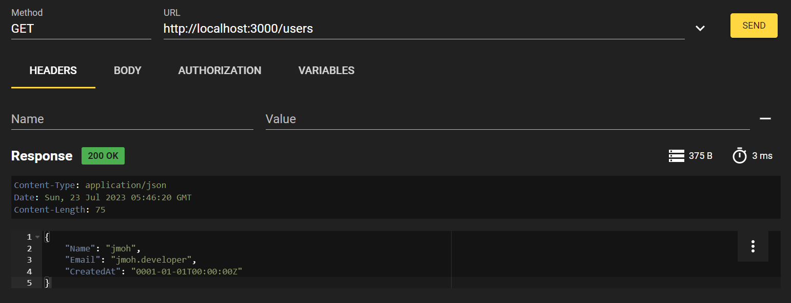
> POST /users

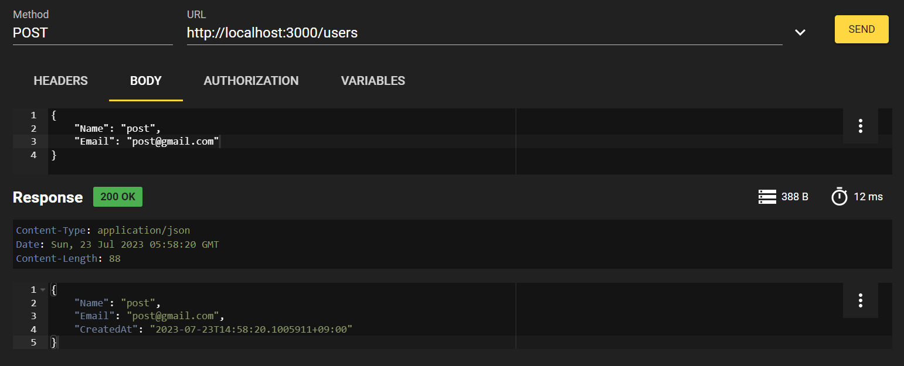

> GET /hello

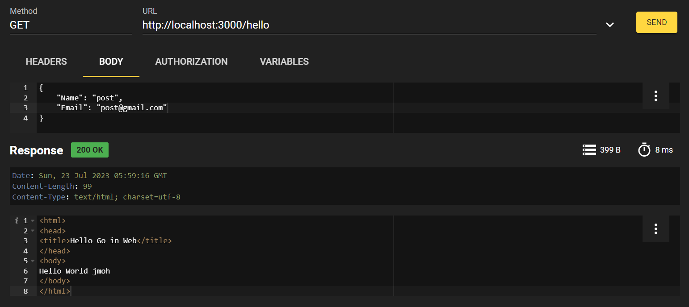


## unrolled/render : rendering package
>
```sh
go get github.com/unrolled/render
```
### render package : set pointer
```go
var rd *render.Render
...
func main(){
	rd = render.New()
	...
}
```
### render package : use
> Before
```go
	w.Header().Add("Content-type", "application/json")
	data, _ := json.Marshal(user)
	w.WriteHeader(http.StatusOK)
	fmt.Fprint(w, string(data))
```
> After
```go
	rd.JSON(w, http.StatusOK, user)	
```
---
> Before
```go
    w.WriteHeader(http.StatusBadRequest)
    fmt.Fprint(w, err)
```
> After
```go
	rd.Text(w, http.StatusBadRequest, err.Error())
```
---
> Before
```go
func helloHandler(w http.ResponseWriter, r *http.Request) {
	tmpl, err := template.New("Hello").ParseFiles("templates/hello.tmpl")

	if err != nil {
		w.WriteHeader(http.StatusInsufficientStorage)
		fmt.Fprint(w, err)
	}
	tmpl.ExecuteTemplate(w, "hello", "jmoh")
}
```
> After
```go
func helloHandler(w http.ResponseWriter, r *http.Request) {
    rd.HTML(w, http.StatusOK, "hello", "jmoh")
}    
```
		

### render package : template process
- render package 의 template 처리는 templates 폴더 내 .tmpl 파일만 가능  
- 기본 확장자 변경 : render 의 Extension 옵션 설정

  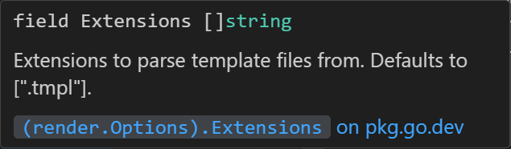  

- 기본 폴더 경로 변경 : render 의 Directory 옵션 설정

  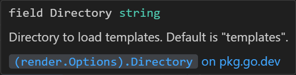  

> PASS : hello.tmpl
```go
func helloHandler(w http.ResponseWriter, r *http.Request) {
    rd.HTML(w, http.StatusOK, "hello", "jmoh")
}    
func main() {
    rd = render.New()
    ...
}
```
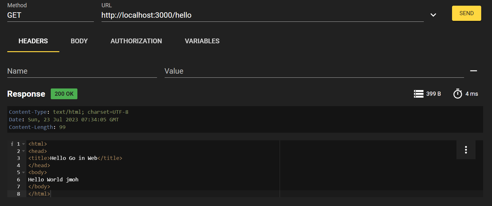

> FAIL : .html
```go
func helloHandler(w http.ResponseWriter, r *http.Request) {
    rd.HTML(w, http.StatusOK, "hello", "jmoh")
}    

func main() {
    rd = render.New()
    ...
}
```


> PASS : .html
```go
func helloHandler(w http.ResponseWriter, r *http.Request) {
	rd.HTML(w, http.StatusOK, "hello", "jmoh")
}

func main() {
	rd = render.New(render.Options{
		Extensions: []string{".html", ".tmpl"},
	})
	mux := pat.New()
	mux.Get("/users", getUserInfoHandler)
	mux.Post("/users", addUserInfoHandler)
	mux.Get("/hello", helloHandler)
	http.ListenAndServe(":3000", mux)
}
```


> PASS : templates/hello.html
```go
func main() {
	rd = render.New(render.Options{
		Extensions: []string{".html", ".tmpl"},
	})
	...
}
```


> FAIL : template/hello.html

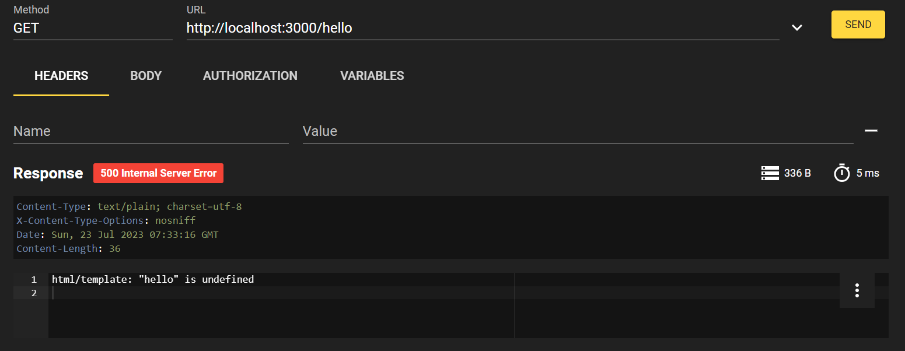

> PASS : template/hello.html

```go
func main() {
	rd = render.New(render.Options{
		Directory:  "template",
		Extensions: []string{".html", ".tmpl"},
	})
	...
}
```


### render package : add Layout
- render package 의 레이아웃 옵션 설정하여 레이아웃 분리
- Layout(hello) → rd.HTML(body)
- hello.html → "yield" → rd.HTML [current] → body → body.html
> template/body.html
```html
Name: {{.Name}}
Email: {{.Email}}
```
> template/hello.html
```html
<html>
<head>
<title>Hello Go in Web</title>
</head>
<body>
Hello World
{{ yield }}
</body>
</html>
```
> main.go
```go
func helloHandler(w http.ResponseWriter, r *http.Request) {
	user := User{Name: "layout", Email: "layout@gmail.com"}
	rd.HTML(w, http.StatusOK, "body", user)
}

func main() {
	rd = render.New(render.Options{
		Directory:  "template",
		Extensions: []string{".html", ".tmpl"},
		Layout:     "hello",
	})
	mux := pat.New()
	mux.Get("/users", getUserInfoHandler)
	mux.Post("/users", addUserInfoHandler)
	mux.Get("/hello", helloHandler)
	http.ListenAndServe(":3000", mux)
}

```
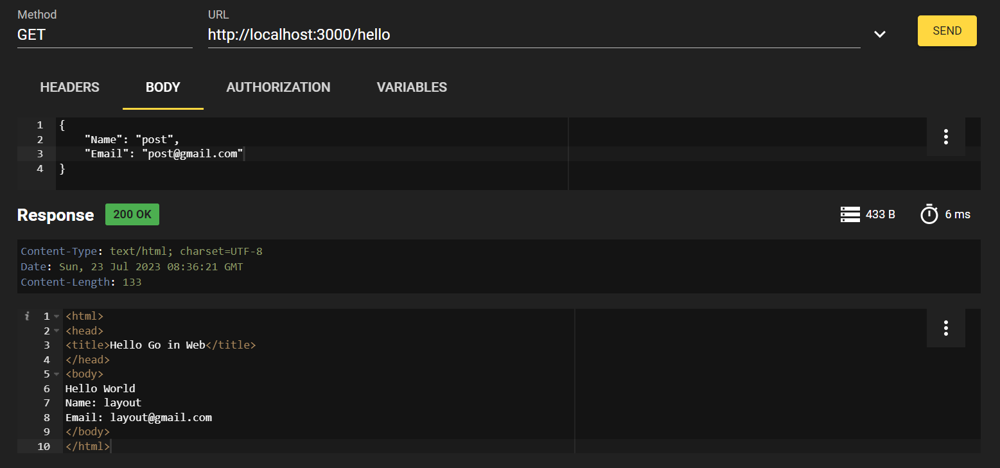

### render package : partial
- Layout(hello) → rd.HTML(body)
- hello.html → partial "title" + rd.HTML [current]  → [patial]-[current] → title-body  → title-body.html
- "yield" → rd.HTML [current] → body → body.html
> template/hello.html
```html
<html>
<head>
<title>{{ partial "title" }}</title>
</head>
<body>
Hello World
{{ yield }}
</body>
</html>
```
> template/title-body.html
```html
Partial Go in Web
```
> main.go
```go
func helloHandler(w http.ResponseWriter, r *http.Request) {
	user := User{Name: "layout", Email: "layout@gmail.com"}
	rd.HTML(w, http.StatusOK, "body", user)
}
...
```
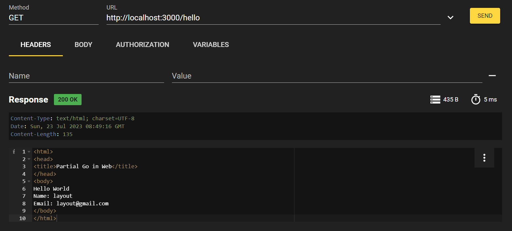

## urfave/negroni : HTTP Middleware package
```sh
go get github.com/urfave/negroni
```
> public/index.html
```html
<html>
    <head>
        <title>Go in Web</title>
    </head>
    <body>
        Hello World
    </body>
</html>
```
### negroni package : set
> Before
```go
func main() {
	...
	mux.Handle("/", http.FileServer(http.Dir("public")))
	http.ListenAndServe(":3000", mux)
}
```
> After
```go
func main() {
	...
	n := negroni.Classic()
	n.UseHandler(mux)
	http.ListenAndServe(":3000", n)
}
```
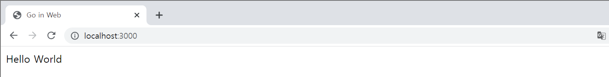
### negroni package : logging (Default)
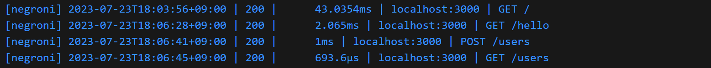