# Template Example

## Example 1
- User struct 정의
- User struct 에 user 데이터 입력
- User struct 에 정의된 변수 들로 파싱 template 생성
- {{.Name}}, {{.Email}}, {{.Age}} : struct 변수 읽는 부분
- template 함수 결과 에러 검사
- tmpl 에 정의된 template 함수를 실행하여 파싱된 결과 standard out 으로 출력  

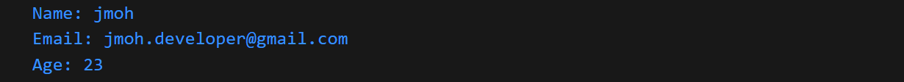

__User struct 에 user2 데이터 추가__

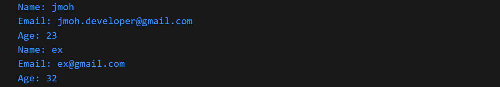

### package main
```go
package main

import (
	"os"
)

type User struct {
	Name  string
	Email string
	Age   int
}

func main() {
	user := User{Name: "jmoh", Email: "jmoh.developer@gmail.com", Age: 23}
	user2 := User{Name: "ex", Email: "ex@gmail.com", Age: 32}
	tmpl, err := template.New("Templ1").Parse("Name: {{.Name}}\nEmail: {{.Email}}\nAge: {{.Age}}")
	if err != nil {
		panic(err)
	}
	tmpl.Execute(os.Stdout, user)
	tmpl.Execute(os.Stdout, user2)
}
```
## Example 2
- 평문 파일로 template 함수에서 사용하는 template 파일 작성(확장자는 내용이 평문이면 아무거나 상관 없음)
- ParseFiles : template 파일에 정의된 내용으로 파싱
- tmpl.ExecuteTemplate(os.Stdout, "tmpl_01", user): template 파일이 여러 개 있을 수 있으므로 특정 template 파일 지정하여 실행
### templates : tmpl_01
```plaintext
	Name: {{.Name}}
    Email: {{.Email}}
    Age: {{.Age}}
```
### package main
```go
package main

import (
	"os"
	"text/template"
)

type User struct {
	Name  string
	Email string
	Age   int
}

func main() {
	user := User{Name: "jmoh", Email: "jmoh.developer@gmail.com", Age: 23}
	user2 := User{Name: "ex", Email: "ex@gmail.com", Age: 32}
	tmpl, err := template.New("Templ1").ParseFiles("templates/tmpl_01")
	if err != nil {
		panic(err)
	}
	tmpl.ExecuteTemplate(os.Stdout, "tmpl_01", user)
	tmpl.ExecuteTemplate(os.Stdout, "tmpl_01", user2)
}
```
## Example 3
- template 파일에서 if 문으로 조건문 반영(Main.go 에 정의한 IsOld 함수 Method 이용)
- func (u User) IsOld() bool { return u.Age > 30 } : User struct 중 .Age 값이 30 이상인 struct 를 True/False 로 확인

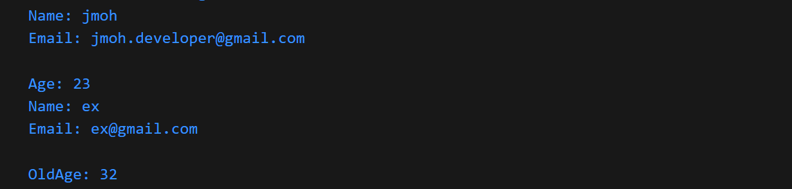

```
template 파일 본문 공백 제거
- IF 문에 사용하는 내용은 개행문자로 처리되어 공백이 발생하므로 공백 제거 필요
- 뒷 부분 공백 제거 : -}} (e.g. {{if ~ -}})
- 앞 부분 공백 제거 : {{- (e.g. {{- {if ~ }})
```
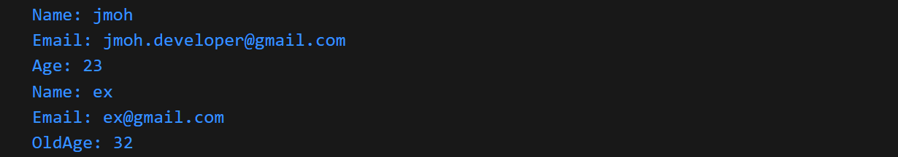
### templates : tmpl_01
```  
Name: {{.Name}}
Email: {{.Email}}
{{if .IsOld -}}
OldAge: {{.Age}}
{{else -}}
Age: {{.Age}}
{{end -}}
```
### package main
```go
package main

import (
	"os"
	"text/template"
)

type User struct {
	Name  string
	Email string
	Age   int
}

func (u User) IsOld() bool {
	return u.Age > 30
}

func main() {
	user := User{Name: "jmoh", Email: "jmoh.developer@gmail.com", Age: 23}
	user2 := User{Name: "ex", Email: "ex@gmail.com", Age: 32}
	tmpl, err := template.New("Templ1").ParseFiles("templates/tmpl_01")
	if err != nil {
		panic(err)
	}
	tmpl.ExecuteTemplate(os.Stdout, "tmpl_01", user)
	tmpl.ExecuteTemplate(os.Stdout, "tmpl_01", user2)

}
```

## Example 4
- template 파일에서 html 태그문 추가

__text type import__
- text 로 import 되면 string 으로 처리되어 태그문 안에 있는 특수문자 출력  

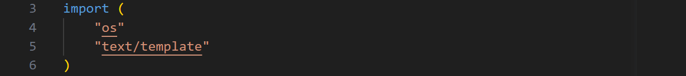
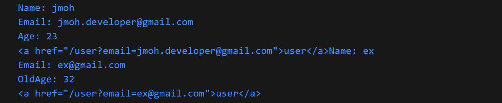

- text 로 import 되면 script 본문도 string 으로 처리  

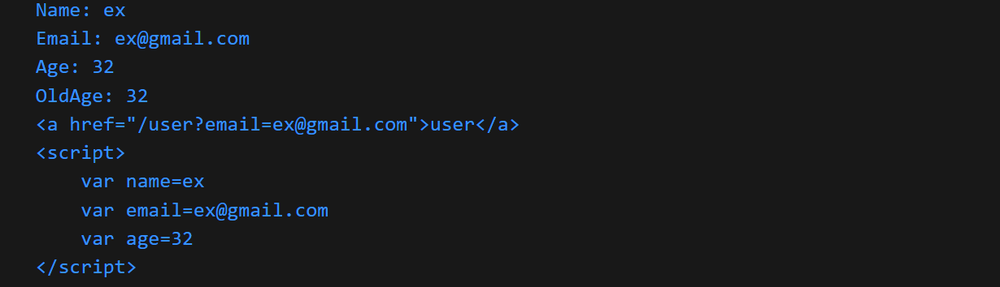

__html type import__
- html 로 import 되면 태그문 안에 있는 특수문자 자동 변환(@ → %40)  

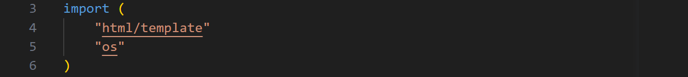
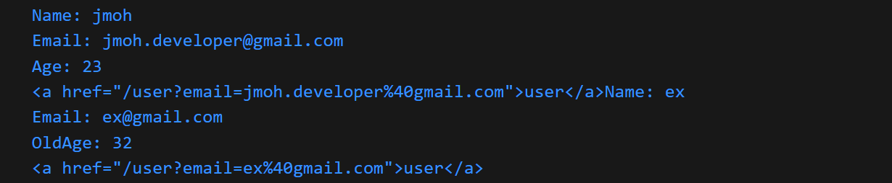

- html 로 import 되면 script 본문도 안 변수 형식에 맞게 처리하여 출력(string → " ")  

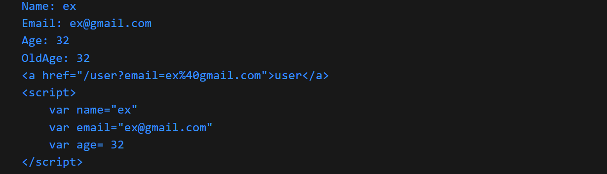
### templates : tmpl_01
```plaintext
Name: {{.Name}}
Email: {{.Email}}
Age: {{.Age}}
{{if .IsOld -}}
OldAge: {{.Age}}
{{else -}}
Age: {{.Age}}
{{end -}}
<a href="/user?email={{.Email}}">user</a>
<script>
var name={{.Name}}
var email={{.Email}}
var age={{.Age}}
</script>
```
## Example 5
- template 파일의 변동성을 고려하여 다른 template 파일로 Instance Include 해서 사용 설정
- html 파일(tmpl_02)에서 template 파일(tmpl_01)의 Instance Include 하여 출력
### templates : tmpl_01
```plaintext
Name: {{.Name}}
Email: {{.Email}}
Age: {{.Age}}
{{if .IsOld -}}
OldAge: {{.Age}}
{{else -}}
Age: {{.Age}}
{{end -}}
<a href="/user?email={{.Email}}">user</a>
<script>
var name={{.Name}}
var email={{.Email}}
var age={{.Age}}
</script>
```
### templates : tmpl_02
```html
<html>
<header>
<title> Template </title>
</header>
<body>
{{template "tmpl_01" .}}
</body>
</html>
```
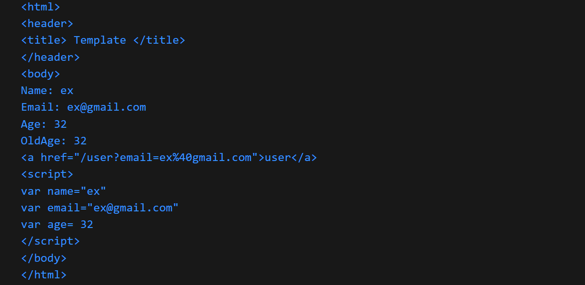

### package main
```go
package main

import (
	"html/template"
	"os"
)

type User struct {
	Name  string
	Email string
	Age   int
}

func (u User) IsOld() bool {
	return u.Age > 30
}

func main() {
	user := User{Name: "jmoh", Email: "jmoh.developer@gmail.com", Age: 23}
	user2 := User{Name: "ex", Email: "ex@gmail.com", Age: 32}
	tmpl, err := template.New("Templ1").ParseFiles("templates/tmpl_01", "templates/tmpl_02")
	if err != nil {
		panic(err)
	}
	tmpl.ExecuteTemplate(os.Stdout, "tmpl_02", user)
	tmpl.ExecuteTemplate(os.Stdout, "tmpl_02", user2)

}
```

## Example 6
- User struct 값들을 array로 생성한 users 리스트에 등록
- tmpl.ExecuteTemplate 을 각 User struct 값들이 아닌 user 리스트로 실행
- html 파일(tmpl_02)에서 ragne 를 이용해서 user 리스트의 각 항목별로 template 파일(tmpl_01)의 Instance Include 실행

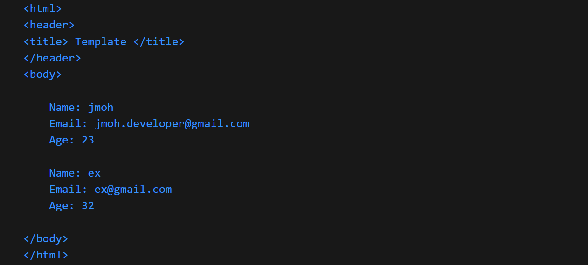

### templates : tmpl_01
```plaintext
Name: {{.Name}}
Email: {{.Email}}
Age: {{.Age}}
```
### templates : tmpl_02
```html
<html>
<header>
<title> Template </title>
</header>
<body>
{{range .}}
{{template "tmpl_01" .}}
{{end}}
</body>
</html>
```
```go
package main

import (
	"html/template"
	"os"
)

type User struct {
	Name  string
	Email string
	Age   int
}

func (u User) IsOld() bool {
	return u.Age > 30
}

func main() {
	user := User{Name: "jmoh", Email: "jmoh.developer@gmail.com", Age: 23}
	user2 := User{Name: "ex", Email: "ex@gmail.com", Age: 32}
	users := []User{user, user2}
	tmpl, err := template.New("Templ1").ParseFiles("templates/tmpl_01", "templates/tmpl_02")
	if err != nil {
		panic(err)
	}
	tmpl.ExecuteTemplate(os.Stdout, "tmpl_02", users)
}
```