# VSCode with Go

## Downloads Page : https://go.dev/dl/  

(Windows 기준) .msi 파일을 실행하거나 .zip 파일을 압축 해제해서 Go 폴더 생성  

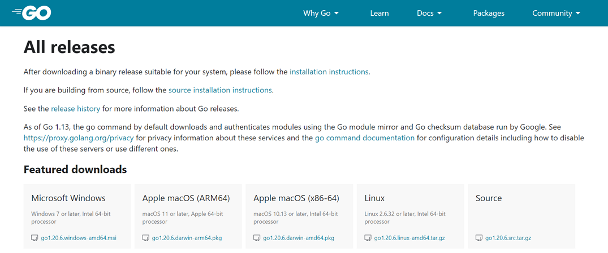
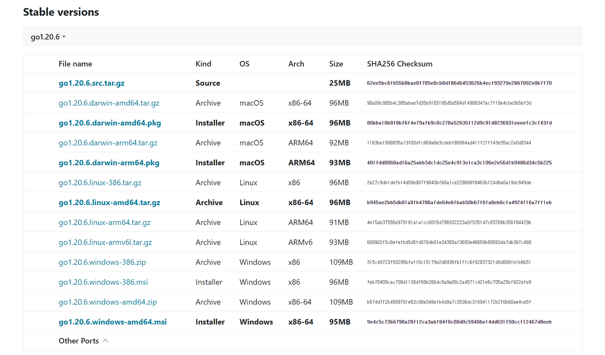

- .msi File  
    > .msi 파일의 기본 설치 경로는 "C:\Program Files\Go" 이지만 다른 경로로 변경해서 설치해도 된다.  

    

- .zip File  
   
    
    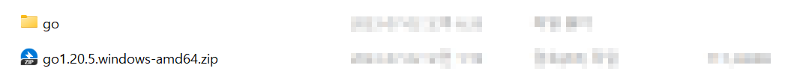

- Go Folder  

    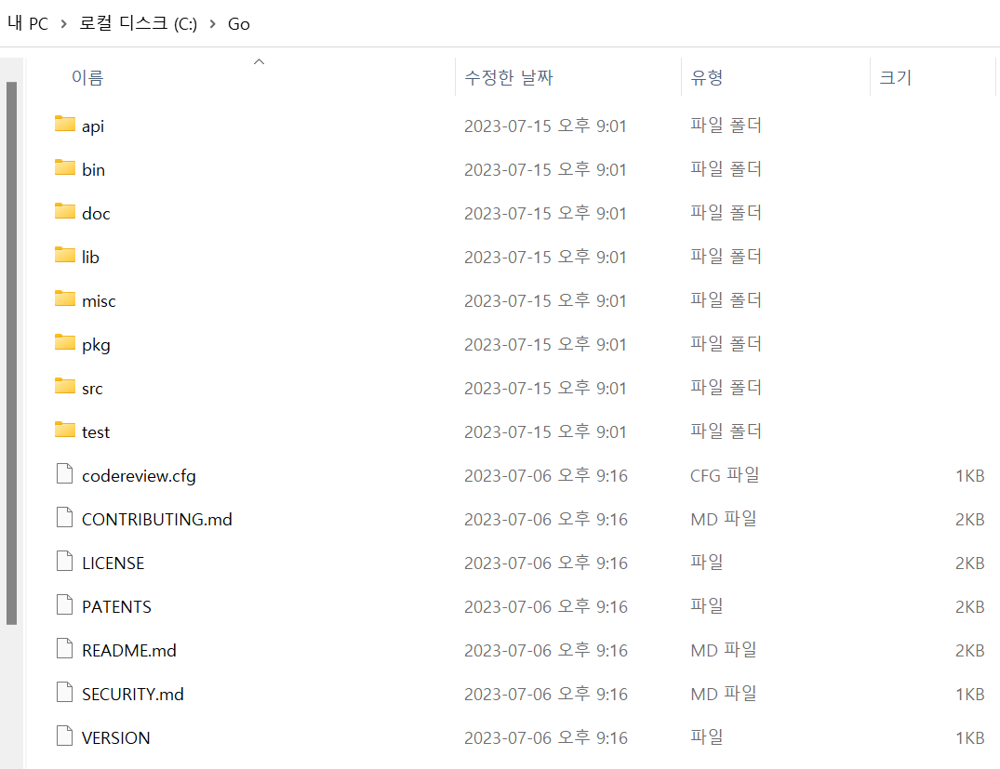

## env 
Command 창을 통해 go 설치 확인
```
go version  
```
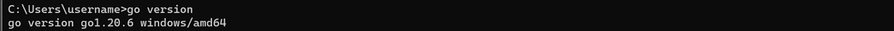

go 환경변수에서 GOPATH 확인
```
go env  
```
> set GOPATH=C:\Users\username\go
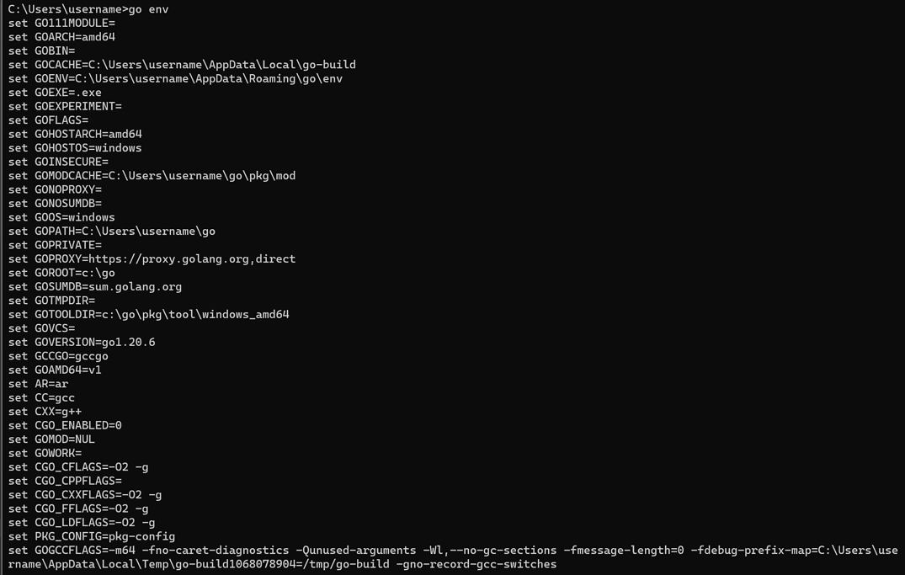

GOPATH 경로 안에 bin, pkg, src 폴더 생성

```
mkdir C:\Users\username\go\bin  
mkdir C:\Users\username\go\pkg  
mkdir C:\Users\username\go\src  
```
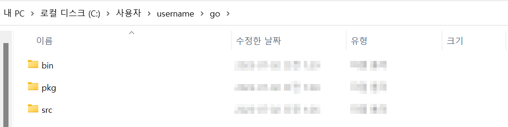

## VSCode with Go
src 폴더 안에 작업 폴더(project) 생성
```
mkdir C:\Users\username\go\src\project
```
<p></p>
<p>VSCode 를 실행하여 Go 폴더 열기  </p>
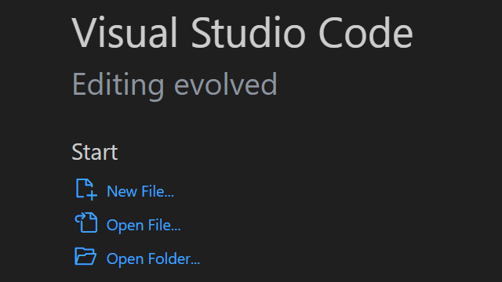
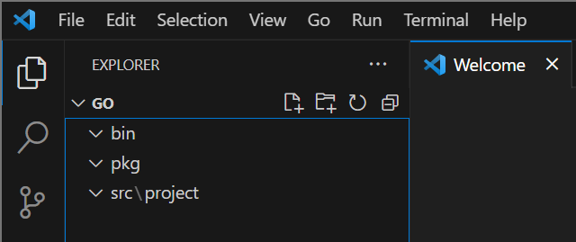
<p></p>
<details>
<summary>explorer 창 디렉터리 트리 설정 변경</summary>
<p></p>
<p>Settings (Ctrl + ,)</p>
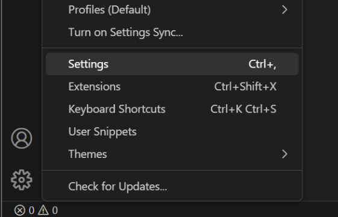
<p></p>
<p>Search 창에서 explorer.compactFolders 검색</p>
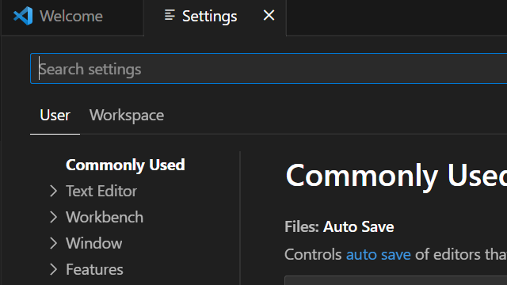
<p></p>
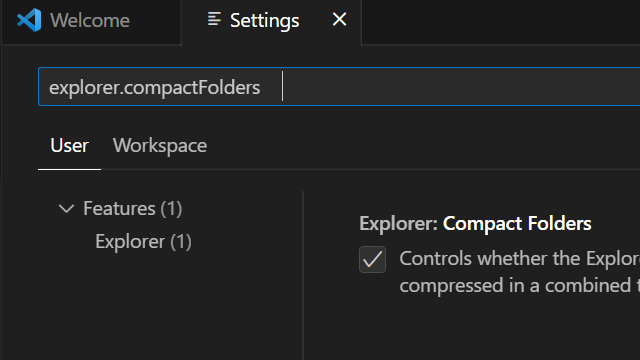
<p></p>
<p>Explorer.Compact Folders 설정 체크박스 해제</p>
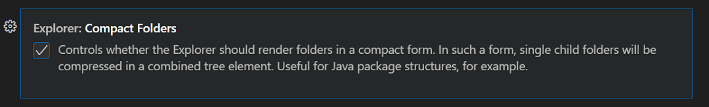
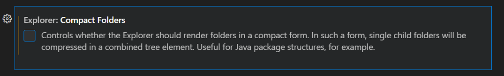
<p></p>
<p>explorer 창 디렉터리 트리 확인</p>
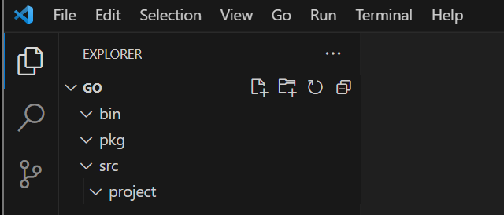
</details>  
<p></p>
<p>main.go 파일 생성</p>
<p></p>
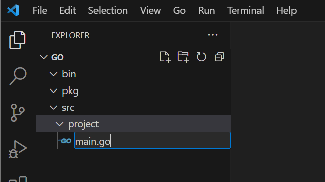
<p></p>
<p>Go Extension 설치</p>
<p></p>
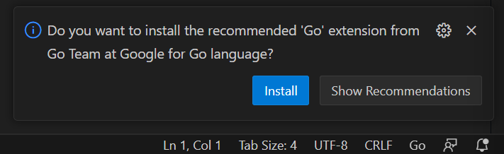
<p></p>
<p>Go Extension 설치 확인</p>

<p></p>
<p>main.go 작성</p>
<p></p>
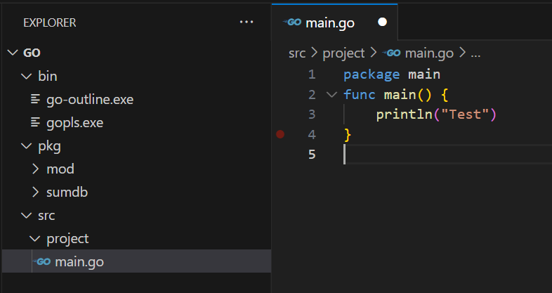
<p></p>
<p>Go command Extension 설치</p>
<p></p>
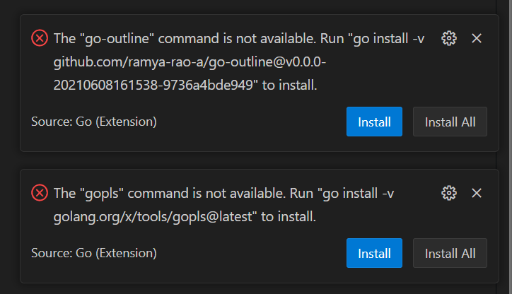
<p></p>
<p>Go command Extension 설치 확인</p>
<p></p>
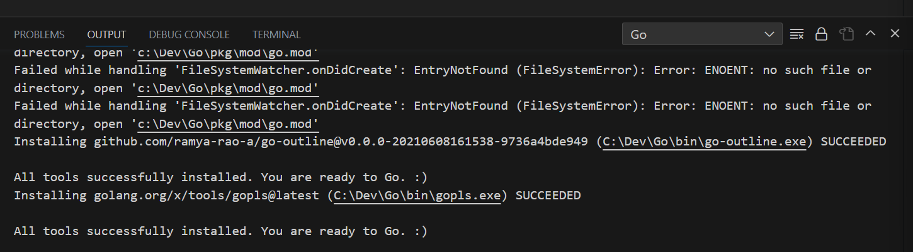
<p></p>
<p>현재 디렉터리를 Module Root 로 설정 후 main.go 실행</p>
<p></p>

```
go mod init
```
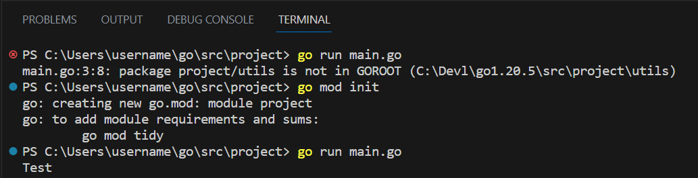
